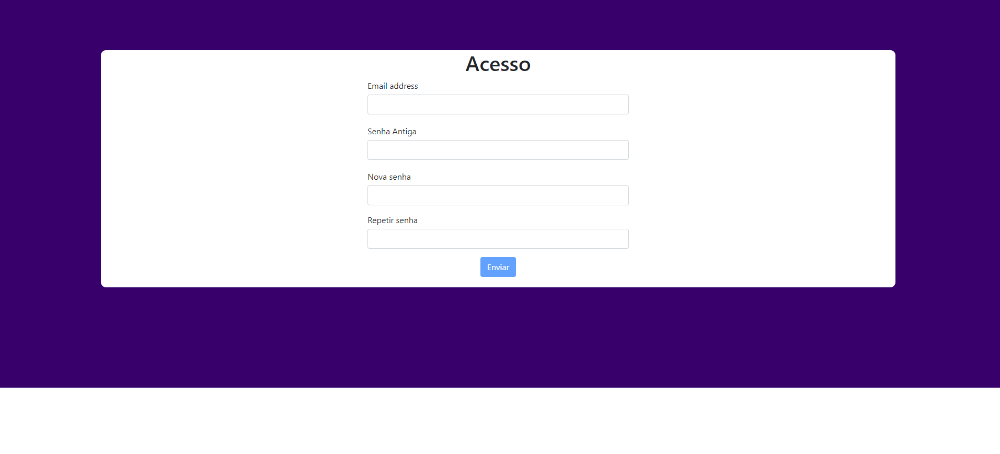

# TelaLogin

Projeto desenvolvido com [Angular CLI](https://github.com/angular/angular-cli) version 13.1.3.

## Rodando o projeto

1 - Abra o terminal da sua preferência(cmd, gitbash, PowerShell).

2 - Insira o comando 'git clone https://github.com/kcsdesenvolvedor/Tela-Login.git'.

3 - Navegue para pasta do projeto com o comando 'cd Tela-Login'

4 - Execulte o comando 'npm install' para instalar a pasta node-module com todas as dependências do projeto.

5 - Dê um run no projeto com o comando 'npm start' ou 'ng serve'.

6 - Navegue para o endereço `http://localhost:4200/` no seu navegador.

## Informações importante

Para habilitar o botão de enviar, todo o campos do formulario precisam está preenchido.

Para obter sucesso no envio os seguintes valores são esperados:

Email => qualquer valor.

Senha Antiga => 12345678.

Nova Senha => pode ser qualquer uma, mas respeitando os critérios de criação de senha.

Repetir Senha => precisa ser a mesma do campo Nova Senha.

## Imagem do Projeto

  

